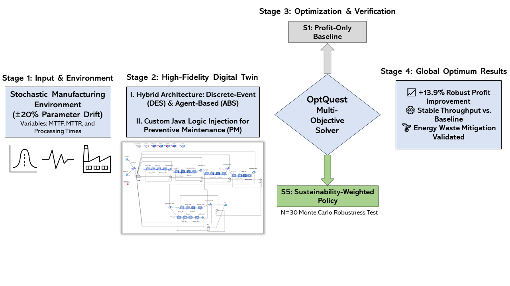
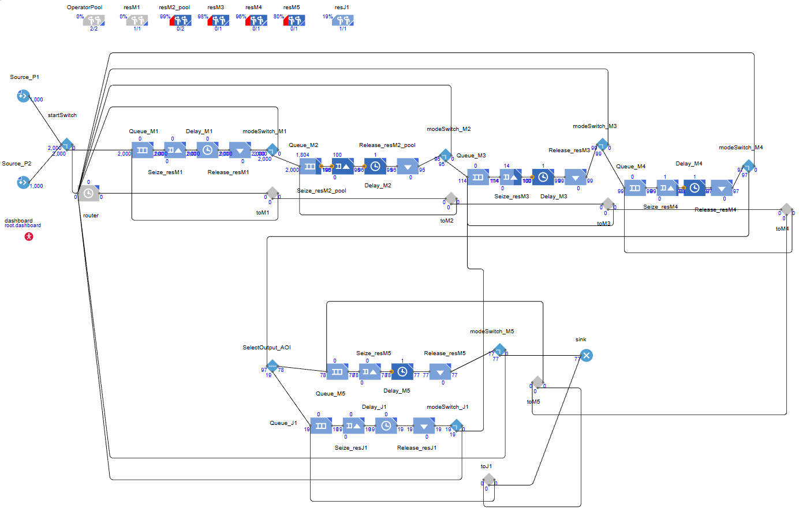
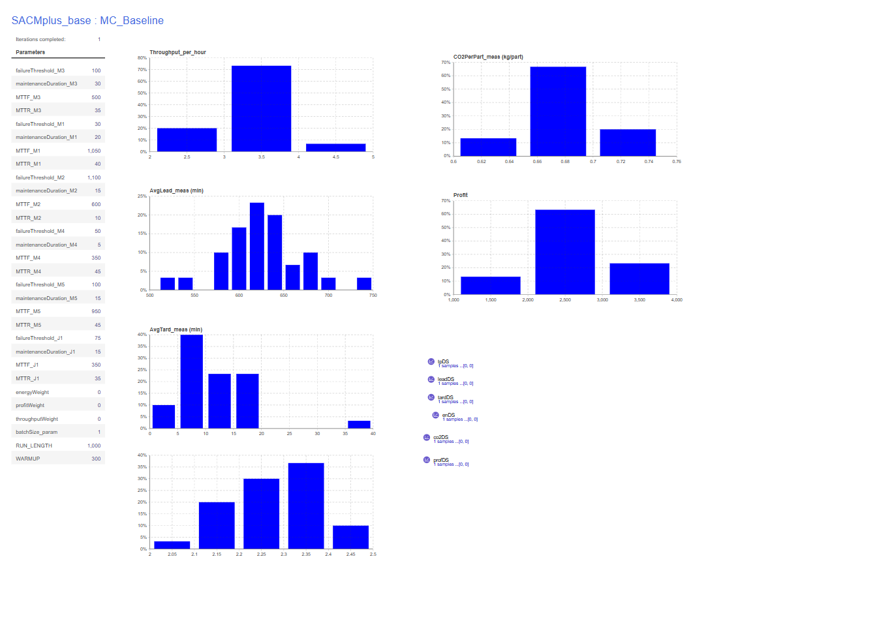
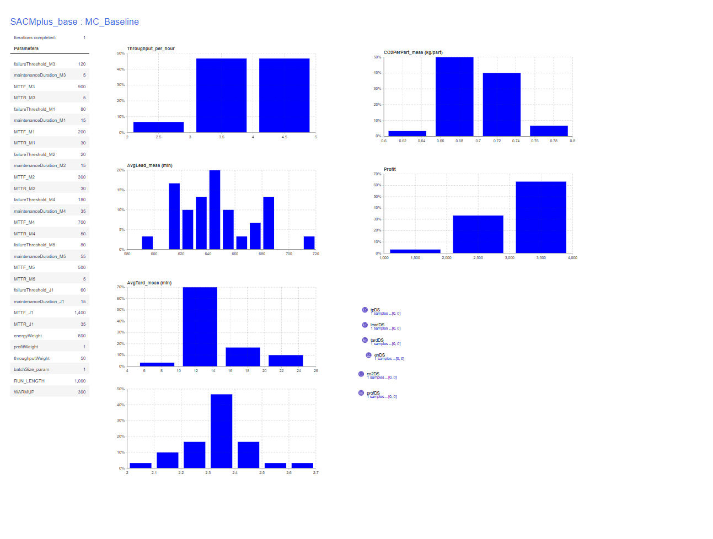

# MADO Framework: Simulation Data & Validation

This folder contains the raw simulation outputs, optimization logs, and technical validation documents for the **Maintenance-Aware Digital Twin (MADO)** research project. 

### **Research Overview**

**Figure 1: MADO Research Framework Overview.** *This diagram illustrates the four-stage pipeline of the Maintenance-Aware Digital Twin. It begins with a stochastic manufacturing environment subjected to ±20% parameter drift, modeled through a hybrid DES/ABS architecture. The framework utilizes an OptQuest Multi-Objective Solver to move beyond traditional profit-only baselines (S1) to a sustainability-weighted policy (S5), achieving a 13.9% increase in robust profit verified through 30 Monte Carlo iterations.*

---

### **Digital Twin Interface & System Logic**

*Figure 2: The high-fidelity AnyLogic interface showing the production line status, maintenance queues, and real-time KPI tracking for the MADO system.*

* **Logic Component:** `MaintenanceLogic for Machine3.txt` — The custom Java logic injected into the simulation to handle predictive maintenance triggers.

---

### **Comparative Stability Analysis**
To prove the resilience of the MADO policy, the following visual results compare the baseline behavior against the optimized state:

| Baseline Instability (S1) | Optimized Stability (S5) |
| :---: | :---: |
|  |  |
| *High variance under equipment aging.* | *Validated stable trajectory.* |

---

### **Data Dictionary**
To interpret the provided `.csv` files, use the following column definitions:

| Column Name | Definition | Unit |
| :--- | :--- | :--- |
| `Replication_ID` | Unique ID for each Monte Carlo run (1–30). | Integer |
| `Mean_Profit` | Net economic output after maintenance and operational costs. | EUR (€) |
| `Throughput` | Total number of units successfully processed by the system. | Units |

---

### **File Descriptions**
* **`Baseline_Profit_Only_Results.csv`**: Performance data for the standard approach.
* **`Optimized_Sustainability_Results.csv`**: Performance data for the optimized MADO policy.
* **`Optimization_Log_500_Iterations.csv`**: Detailed search history of the OptQuest solver.
* **`Optimal_Java_Parameters_S5.csv`**: The specific parameters used to achieve the S5 results.
* **`Stress_Test_20_Percent_Drift.csv`**: Data showing system stability under 20% degradation.
* **`Technical_Validation_Report.pdf`**: The full technical analysis of the simulation results.
