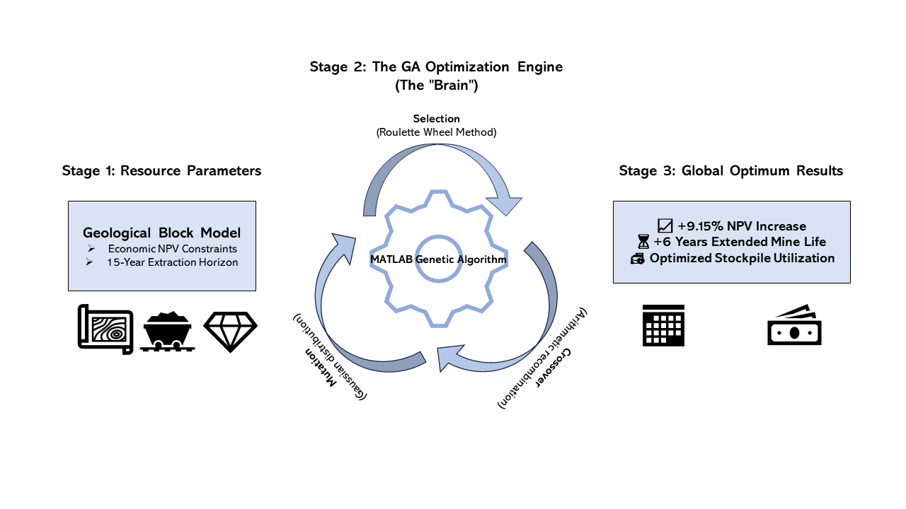
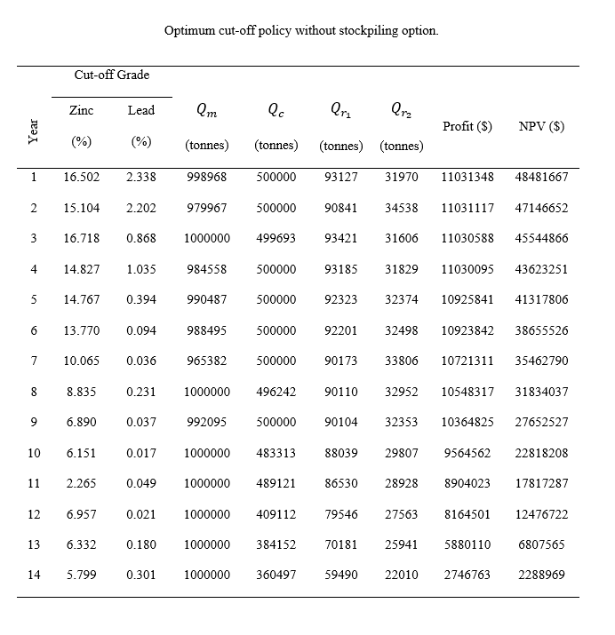
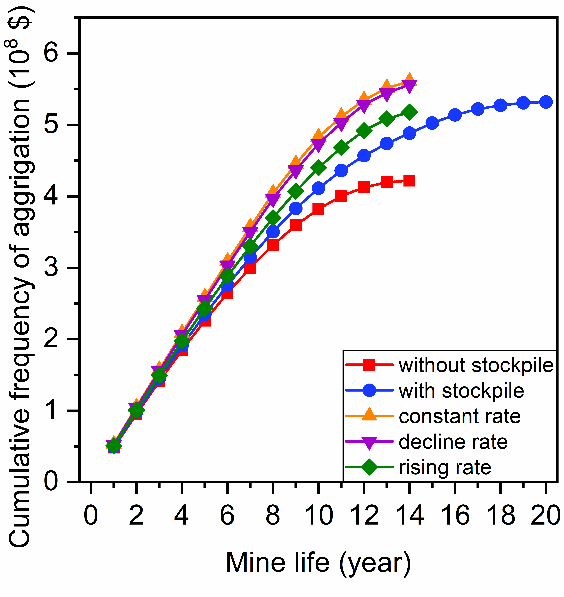
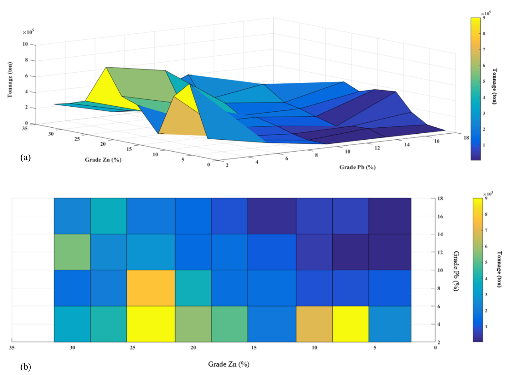

# Meta-Heuristic Mining Optimization: Genetic Algorithms for NPV Maximization

This folder contains the MATLAB implementation and published research for optimizing extraction policies in Lead-Zinc deposits.

### **Core Research Impact**
By integrating a custom Genetic Algorithm (GA) with a 29-variable search space, this project solves the "Cut-off Grade" problem more effectively than traditional deterministic methods.
* **NPV Augmentation:** **+9.15% increase** compared to baseline Lane models.
* **Operational Longevity:** Extended mine life by **6 years** through optimized stockpiling.

---

### **Methodology & Workflow**

**Figure 1: Genetic Algorithm Optimization Workflow.** *This diagram outlines the meta-heuristic approach for long-term mine planning. It begins with geological and economic constraints (Stage 1), which are processed through a MATLAB-based Genetic Algorithm loop involving selection, crossover, and mutation operators (Stage 2). The final output (Stage 3) is a globally optimized schedule that delivers a 9.15% increase in Net Present Value (NPV) and extends the mine's life by 6 years.*

---

### **Strategic Results**

**Figure 2: Optimized 15-Year Extraction Schedule.** *This table illustrates the globally optimized production sequence generated by the Genetic Algorithm. By dynamically adjusting cut-off grades and integrating simultaneous stockpiling, the model achieved a stable production flow and maximized total NPV over the 15-year life of the mine.*

---

### **Technical Analysis & Convergence**
Additional outputs demonstrating the algorithm's performance and sensitivity.

| GA Convergence Trace | NPV Sensitivity Analysis |
| :---: | :---: |
|  |  |
| *Figure 3: The GA reaching the global optimum.* | *Figure 4: Impact of grade variability on NPV (Contour Analysis).* |

---

### **Technical File Inventory**
#### **MATLAB Engine Components**
* **`genetic.m`**: The primary optimization engine loop.
* **`NPV.m`**: Fitness function evaluating the Lane Economic Model.
* **`crossover.m` / `Mutate.m`**: Custom genetic operators.
* **`RoulettWeelSelection.m`**: Selection logic for population evolution.
* **`createrandomsolution.m`**: Initialization script.

#### **Documentation & Supporting Data**
* **`ssrn-5186606.pdf`**: Published research extract (University of Kashan).
* **`NPV_Optimization_Contour.png`**: Visual proof of the 29-variable search space optimization.
* **`Mining modeling.png`**: Screenshot of the MATLAB environment logic.
* **`Grade_Distribution_Analysis.png`**: Statistical breakdown of the deposit input data.

### **Reference**
Khademi, M. (2025). *Meta-Heuristic Optimization of Mining Extraction Sequences*. [View on SSRN: 5186606](https://ssrn.com/abstract=5186606)
